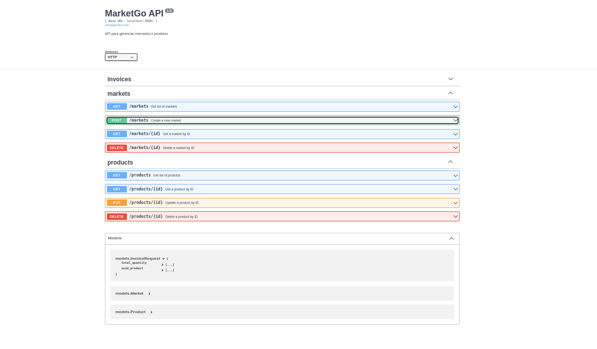

## MarketGo

### Setup

To run the project, you need to have the following installed:

- Go 1.16 or later
- MongoDB

### Running the project

1. Clone the repository
2. Run `go mod download` to download the dependencies
3. Run `go run main.go` to start the server
4. The server will be running on `localhost:3000`

### Endpoints

- `GET /products`: Get all products
- `POST /products`: Create a new product
- `GET /products/:id`: Get a product by ID
- `PUT /products/:id`: Update a product by ID
- `DELETE /products/:id`: Delete a product by ID

- `GET /markets`: Get all markets
- `POST /markets`: Create a new market
- `GET /markets/:id`: Get a market by ID
- `PUT /markets/:id`: Update a market by ID

You can acess the api using Swagger on `localhost:3000/swagger/index.html`

### Running the tests

To run the tests, you can run `go test ./...` in the root directory of the project

### Technologies

- Go
- MongoDB
- Fiber
- GORM
- Swagger
- JWT
- ElasticMail
